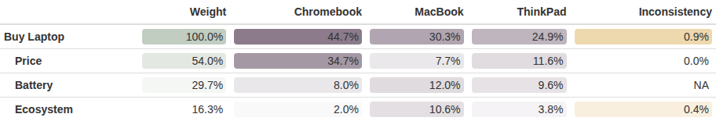

## The model, evaluated live

```{r}
library(ahp)
ahpFile <- system.file("extdata", "laptop.ahp", package = "ahp")
laptopAhp <- Load(ahpFile)
Calculate(laptopAhp)
Analyze(laptopAhp)
```

The Chromebook wins with a total weight of 44.7%, driven by Price
(54.0% of the decision). The winning priorities per criterion are
$34.7\%$ (Price), $12.0\%$ (Battery, MacBook) and $10.6\%$
(Ecosystem, MacBook).

## The colored table as a figure

`AnalyzeTable()` returns a `formattable` object, i.e. an HTML table.
Typst cannot render HTML, so the table is screenshotted to PNG once
(with `webshot2` and Chromium, see the "Choosing a laptop with AHP"
vignette) and embedded here as a regular figure:


