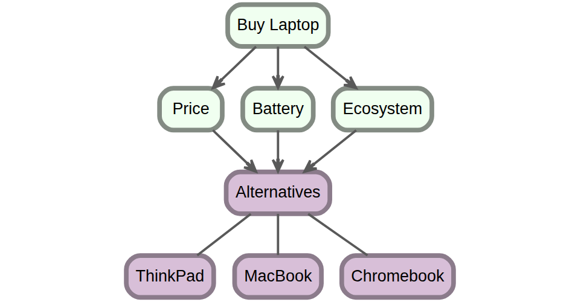

## The model, evaluated live

```{r}
library(ahp)
ahpFile <- system.file("extdata", "laptop.ahp", package = "ahp")
laptopAhp <- Load(ahpFile)
Calculate(laptopAhp)
Analyze(laptopAhp)
```

The Chromebook wins with a total weight of 44.7%, driven by Price
(54.0% of the decision). The winning priorities per criterion are
$34.7\%$ (Price), $12.0\%$ (Battery, MacBook) and $10.6\%$
(Ecosystem, MacBook).

## The colored table, natively in Typst

`AnalyzeTable()` returns a `formattable` object, i.e. an HTML table, which
Typst cannot render. `AnalyzeTableTiny()` produces the same colored table
as a `tinytable` object, rendered natively in each output format
(HTML, LaTeX/PDF and Typst) — no screenshots needed:

```{r}
AnalyzeTableTiny(laptopAhp)
```

For wide tables that do not fit on a Typst page, shrink the font, e.g.
`AnalyzeTableTiny(carAhp, fontsize = 0.8)`. The only difference with
`AnalyzeTable()` is that no warning icon is shown for high
inconsistency (the background color is kept).

The screenshot approach (capture the `formattable` table to PNG with
`webshot2` and embed the image) remains available and is documented in
the "Choosing a laptop with AHP" vignette.

## The decision tree as a figure

`Visualize()` returns a DiagrammeR `grViz` widget (interactive HTML),
which Typst cannot render either: used live, knitr prints a
"PhantomJS not found" message and embeds a cropped, partial image.
Screenshot it once and embed the PNG:

```{r export-tree, eval=FALSE}
htmlwidgets::saveWidget(Visualize(laptopAhp), "laptop-tree.html",
                        selfcontained = TRUE)
webshot2::webshot("laptop-tree.html", "laptop-tree.png",
                  selector = ".grViz", delay = 3)
```

The `selector = ".grViz"` crops tightly to the tree (no whitespace) and
`delay = 3` lets viz.js finish drawing before the capture:


